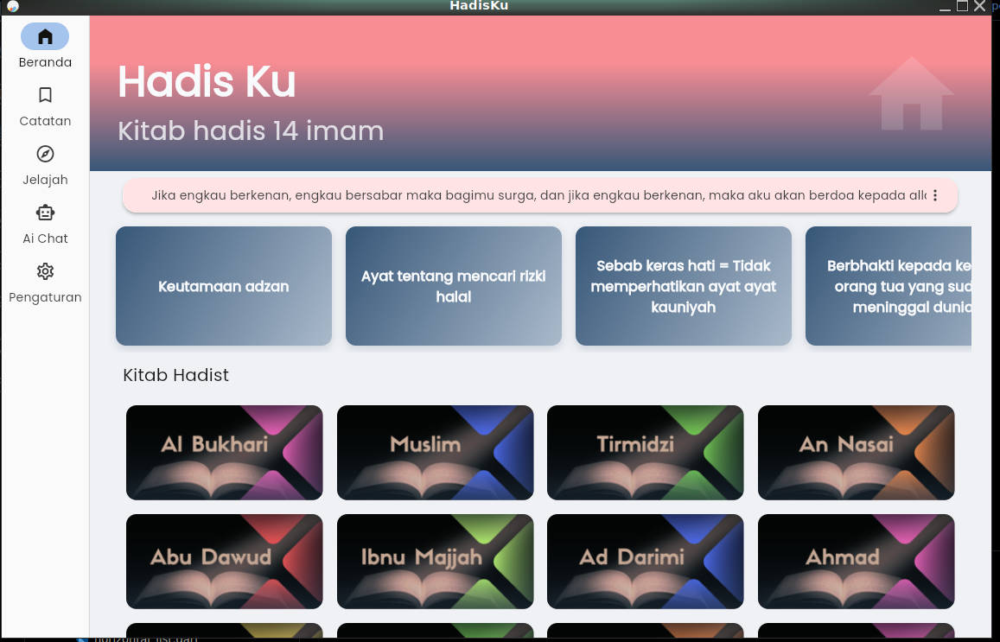
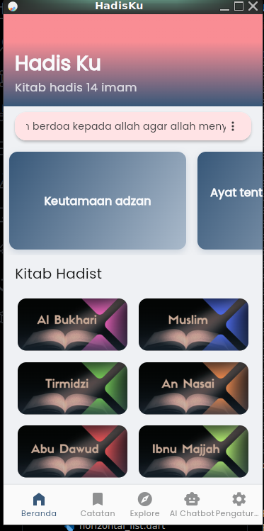

# HadisKu – Kitab Hadis 14 Imam

**HadisKu** adalah aplikasi multi-platform yang menyatukan koleksi otentik dari **14 Imam** dalam satu tempat, sehingga memudahkan Anda mempelajari, merujuk, dan berbagi Hadits di mana pun Anda berada.

## 

## 🌟 Selamat datang di HadisKu

**HadisKu** dirancang untuk membantu umat Islam memperdalam pengetahuan dan pemahaman mereka tentang hadis, menawarkan perpustakaan digital yang kaya dan mudah diakses berisi karya-karya 14 ulama terkemuka. Baik untuk belajar, mengajar, maupun refleksi pribadi, HadisKu adalah teman Anda untuk eksplorasi hadis yang autentik.

Daftar Hadist, diantaranya :

- Hadits Imam Bukhari
- Hadits Imam Muslim
- Hadits Sunan Tirmidzi
- Hadits Sunan An Nasai
- Hadits Sunan Abu Dawud
- Hadits Sunan Ibnu Majjah
- Hadits Sunan Ad Darimi
- Hadits Musnad Ahmad
- Hadits Muwatha Malik
- Hadits Sunan Daruquthni
- Hadits Shahih Ibnu Khuzaimah
- Hadits Shahih Ibnu Hibban
- Hadits Al Musdatrak
- Hadits Musnad Syafii

---

## 📱 Unduh HadisKu

HadisKu tersedia di semua platform utama:

| Platform       | Unduh                                                                             | Persyaratan   |
| -------------- | --------------------------------------------------------------------------------- | ------------- |
| 🖥️ **Windows** | [Unduh](https://flagodna-developer.github.io/hadisku/download/windows)            | Windows 10+   |
| 🍎 **macOS**   | Dalam proses                                                                      | macOS 10.15+  |
| 🐧 **Linux**   | [Unduh](https://flagodna-developer.github.io/hadisku/download/linux)              | Ubuntu 18.04+ |
| 📱 **Android** | [Google Play](https://play.google.com/store/apps/details?id=com.flagodna.hadisku) | Android 6.0+  |
| 🍎 **iOS**     | Dalam proses                                                                      | iOS 12.0+     |

---

## ✨ Mengapa Anda Akan Menyukainya

### 🔖 **Bookmarks**

Simpan dan atur Hadits favorit Anda dengan mudah untuk akses cepat.

### 📚 **Koleksi Lengkap**

Mencakup karya dari 14 Imam terkemuka yang mencakup semua tema Hadits utama.

### 🌙 **Akses Offline**

Belajar tanpa internet—bawa perpustakaan Hadits Anda ke mana pun Anda pergi.

### 🔍 **Pencarian Bertenaga**

Temukan Hadits dengan cepat berdasarkan kata kunci, topik, atau sumber.

### 🎨 **Antarmuka Bersih**

Desain intuitif dan mudah digunakan untuk semua pengguna.

---

## 🆘 Roadmap

Rencana pengembangan aplikasi **Hadisku** ke depan.

### ✅ v2.5.1 — Versi Saat Ini

- [x] **Pembuat Kartu Hadis**  
       Ubah hadis favorit menjadi kartu gambar yang indah dan siap dibagikan ke media sosial.

- [x] **Pencarian lebih cepat dan akurat**  
       Cari hadis berdasarkan teks maupun nomor kini lebih cepat, lebih ringan, dan lebih presisi.

- [x] **Optimasi performa aplikasi**  
       Berbagai peningkatan sistem agar aplikasi terasa lebih ringan, responsif, dan nyaman digunakan.

### 🚧 v3.0.0 — Sedang Berjalan

- [x] **Pembaruan ikon aplikasi**  
       Mengganti ikon lama dengan ikon baru yang lebih fresh dan representatif.

  | Sebelum                                | Sesudah                                |
  | -------------------------------------- | -------------------------------------- |
  |  |  |

- [ ] **Menghapus iklan di aplikasi**  
       Pengalaman menggunakan Hadisku akan dibuat lebih nyaman tanpa iklan.  
       _Saran dari: Gathut Bintoro, Herfando_

- [ ] **Pencarian teks Arab**  
       Menambahkan fitur pencarian hadits berdasarkan teks Arab.  
       _Saran dari: Sopandi Akbar_

- [ ] **Pengaturan urutan detail hadits**  
       Menambahkan opsi tampilan:

  - Arab → Indonesia
  - Indonesia → Arab  
    _Saran dari: Sopandi Akbar_

- [ ] **Menghapus IAP & langganan**  
       Fitur pembelian dalam aplikasi dan langganan akan dihapus.  
       Dukungan pengembangan dapat dilakukan melalui donasi:  
       **https://dukung.flagodna.com**

- [ ] Rilis OS Android
- [ ] Rilis OS Windows
- [ ] Rilis OS Linux

---

## ❤️ Misi Kami

- 🕌 **Untuk menyebarkan pengetahuan kepada setiap Muslim dengan penuh perhatian dan keaslian.**
- 📖 **Untuk membuat studi Hadis menjadi mudah, terjangkau, dan menyenangkan.**
- 🤝 **Untuk mendukung pembelajaran seumur hidup dalam umat Islam.**

---

## 🚀 Memulai

1. **Unduh** aplikasi untuk platform Anda dari tabel di atas.
2. **Instal** aplikasi tersebut mengikuti proses instalasi standar sistem Anda.
3. **Buka** HadisKu dan mulailah perjalanan spiritual Anda.
4. **Jelajahi** fitur-fiturnya dan sesuaikan dengan preferensi Anda.

---

## 📸 Screenshots

---

## 🔗 Jelajahi Lebih Lanjut

| Link                                                                                             | Deskripsi                                 |
| ------------------------------------------------------------------------------------------------ | ----------------------------------------- |
| [⭐ Berikan Rating Aplikasi](https://play.google.com/store/apps/details?id=com.flagodna.hadisku) | Umpan balik Anda membantu kami berkembang |
| [🌐 Situs Web Resmi](https://flagodna-developer.github.io/hadisku/)                              | Temukan lebih banyak tentang visi kami    |
| [💻 Proyek GitHub](https://github.com/Flagodna-Developer/hadisku)                                | Lihat bagaimana aplikasi ini dibangun     |
| [🤝 Berkontribusi](https://github.com/Flagodna-Developer/hadisku/blob/main/CONTRIBUTING.md)      | Bantu tingkatkan HadisKu                  |
| [📱 Unduh di Perangkat Lain](https://flagodna-developer.github.io/hadisku/download/)             | Tersedia di mana pun Anda membutuhkannya  |

---

## 🙌 Di Balik HadisKu

|  **[Cahyanudien AS](https://github.com/cas8398)** |
| :--------------------------------------------------------------------------------------------------------------: |
|                                          ✨ Pencipta & Pengelola Utama                                           |

## 🆘 Dukungan & Masukan

Butuh bantuan atau ingin berbagi masukan?

- 📧 **Email**: flagodna.com@gmail.com
- 🐛 **Laporan Bug**: [GitHub Issues](https://github.com/Flagodna-Developer/hadisku/issues)

## 🙏 Ucapan Terima Kasih

Terima kasih khusus kepada semua pengguna yang telah memberikan umpan balik dan membantu membuat HadisKu lebih baik untuk seluruh umat Muslim.

---

**Dibuat dengan ❤️ untuk Umat Muslim**

_“Barangsiapa yang menempuh jalan untuk mencari ilmu, Allah akan memudahkan baginya jalan menuju surga.” - Nabi Muhammad ﷺ (HR. Muslim)_
